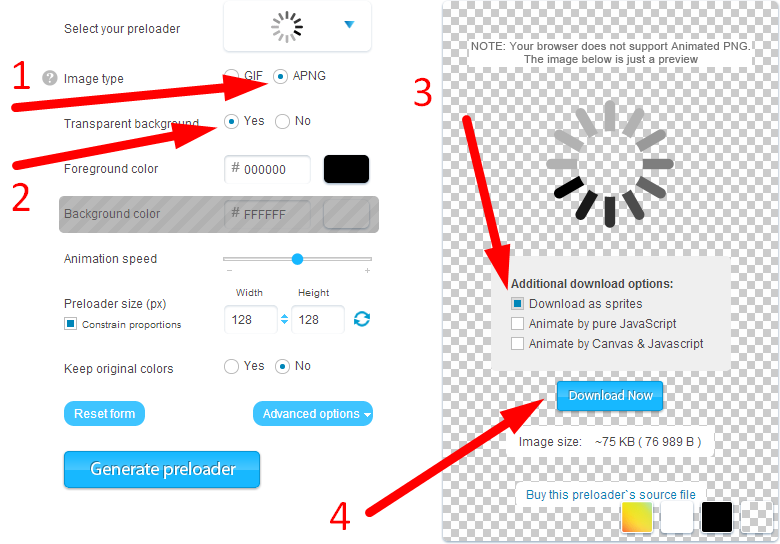

pngif
=====

It's a jQuery Plugin, Frame animation for PNG sprites.

Alternative for APNG, animates images.

The advantage is that it is obtained as a normal image in `` tag

For example, you can download repository and check out example.html

Default initialization does - frame 8, position: right.

You can set only a number of your animate image frame.

Example code
=====

	$('.pngif').pngif();
	$('.pngif').pngif({
		frame: 12,
		width: 40,
		position: 'top',
		delay: 250
	});
	$('.pngif').pngif('destroy');

Where can I get free sprites?
=====
 - http://preloaders.net/

Описание
=====
Для решения трудности с прозрачностью альфа GIF тенями, которые не доступны.
Принцеп похож на APNG, png спрайт изображение с автоматическим переключением кадров.

Плагин работает по принципу interval, ссылка на репозиторий: 
https://github.com/Vaflan/pngif 

Немного о возможностях:
- достаточно взять jQuery элемент и применить `.pngif()` указав количество кадров в спрайте изображения 
- есть возможность указать позицию кадров начиная с top или left 
- можно указать период переключения в миллисекундах (по дефолту 100мс) 
- можно указать в какую сторону пролистать спрайты (right, down, top, left) 
- так же можно указать определённый размер вырезаемого спрайта, в случае если на спрайте есть лишние элементы как у fancybox preload 
- можно использовать технологию CSS3, достаточно добавить параметр `{css3: true}`

Если есть идеи или как его улучшить - пишите, объязательно посмотрим!